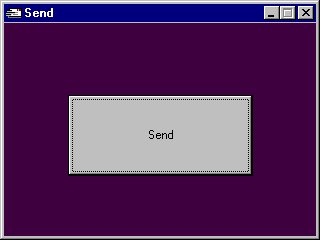



## PrjSend

### Description

This Code teaches you how to send an E-Mail message to a chosen E-Mail Address. Very Useful!!! PLEASE GIVE A COMMENT ABOUT THIS CODE SO I CAN IMPROVE IT.
 
### More Info
 
Please enjoy my code but don't redo it and/or send it to other people.

             |
---                |---
**Submitted On**   |2000-10-10 19:52:16
**By**             |[Nick Solly](https://github.com/Planet-Source-Code/PSCIndex/blob/master/ByAuthor/nick-solly.md)
**Level**          |Intermediate
**User Rating**    |5.0 (10 globes from 2 users)
**Compatibility**  |VB 6\.0
**Category**       |[Internet/ HTML](https://github.com/Planet-Source-Code/PSCIndex/blob/master/ByCategory/internet-html__1-34.md)
**World**          |[Visual Basic](https://github.com/Planet-Source-Code/PSCIndex/blob/master/ByWorld/visual-basic.md)
**Archive File**   |[CODE\_UPLOAD1056510102000\.zip](https://github.com/Planet-Source-Code/nick-solly-prjsend__1-11984/archive/master.zip)

